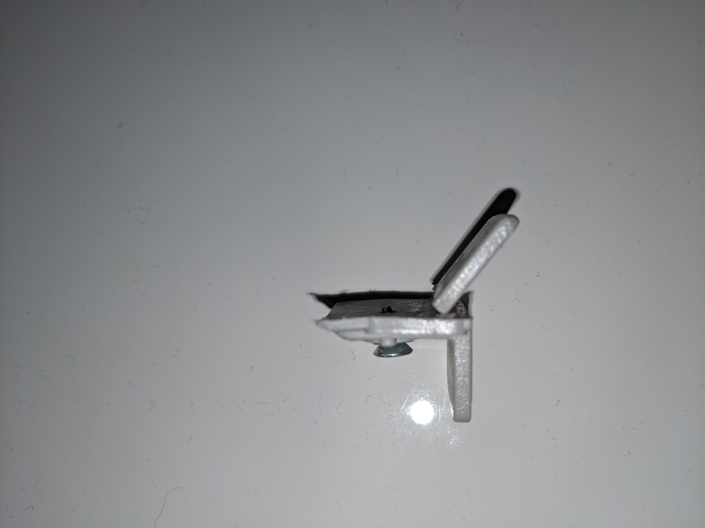
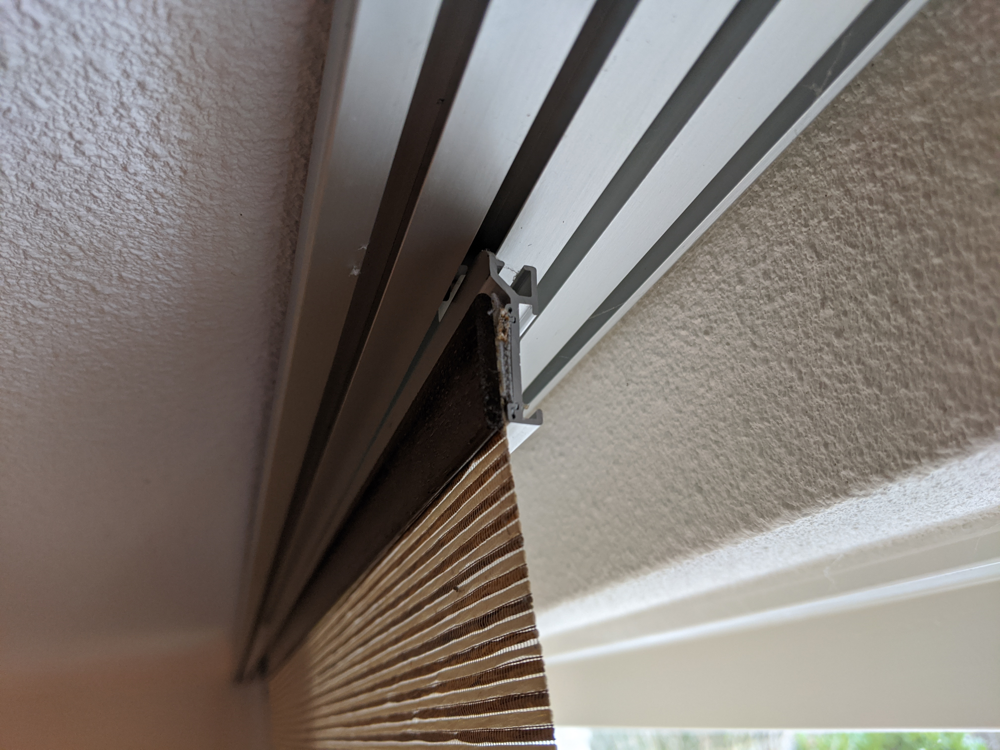

# panelcurtainclip
panel curtain clip 2010 Luxaflex (paneelgordijn)

After ten years a clip (klip in dutch) broke from a panel of my washi panel curtains. It's a small clip of cheap plastic that connects a panel with the previous.
Because the clip broke I tried to contact the producer and the retailer. The retailer tried to find a spare but only had a smaller variant that did not fit.
I couldn't recollect what brand the panels were but after a talk with the retailer I understood it's Luxaflex.

So after multiple dissapointments I dicided to model the part and print it because the part (very cheap) wasn't available.

In this repo you can find the stl file of the clip.

Below some pictures of the panel and the borken part:
-  The Washi panel
-  The clip (broken)
-  The insert for the clip
-  The back attachment

Hope this works for you.
